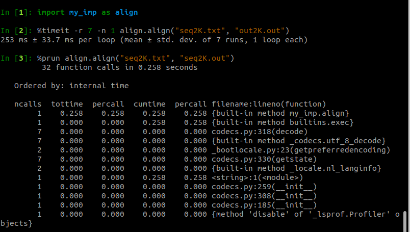

# 1. The general modifications that you have done in your code
The code of both the original and the improved versions can be founr in sections 4 and 5.  
The general modifications imply static type declarations where possible. That means that variables will be defined using C types, such as int, char or list, while functions will be defined using cdef or cpdef (in case it needs to be accessed from actual python interpreters). I also added memory views to numpy matrixes to efficiently access those matrixes.  
Some Cython parameters were also tweaked to allow faster runtimes and/or to properly execute the functions as they were coded.  

# 2. The performance of your code as millions of cells processed per second, and factor out this performance indicating the codification efficiency, the processor throughput and the H/W speed.
The overall performance improvements are compared below:  
**Original version:**  
  
**Improved version:**  
  
**Perf stats of the improved version**  
```{}
biom-4-3@aolin-login:~/Escritorio/github/masters/module_v/APM-II/late_ass$ perf stat
python -c 'import my_imp as align; align.align("seq20K.txt", "seq20K.out")'

 Performance counter stats for 'python -c import my_imp as align;
                                align.align("seq20K.txt", "seq20K.out")':

          22152,61 msec task-clock                #    0,998 CPUs utilized          
                78      context-switches          #    0,004 K/sec                  
                 4      cpu-migrations            #    0,000 K/sec                  
           3379879      page-faults               #    0,153 M/sec                  
       74645953879      cycles                    #    3,370 GHz                    
       29777446271      stalled-cycles-frontend   #   39,89% frontend cycles idle   
        8305212734      stalled-cycles-backend    #   11,13% backend cycles idle    
      156420710761      instructions              #    2,10  insn per cycle         
                                                  #    0,19  stalled cycles per insn
       22650669559      branches                  # 1022,483 M/sec                  
           9990243      branch-misses             #    0,04% of all branches        

      22,192649466 seconds time elapsed

      17,409475000 seconds user
       4,742222000 seconds sys
       

```
## Performance metrics
**OpRate**  
Operations/Instructions:  
20000 * 10/156420710761=0.0000012786  
**Instructions per cycle (IPC)**  
2,10  
**Clock frequency**  
n_cycles/elapsed time (s):  
74645953879/22,192649466=3363544041.61 (cells per second)  
**CPU time**   
instructions/(IPC * clock frequency)  
156420710761/(2,10 * 3363544041.61)=22.1451099857 (H/W speed)


# 3. The reasons that make your code faster than the original Python version.  
1. Tweak Cython to assume that some errors are not present in the code. That includes @cython.wraparound(False) and @cython.initializedcheck(False).  
2. Use memory views were possible. It is the case for the dp_matrix that we use in many of the functions.  
3. Define variables as C data types, specially focusing on the most computationally expensive function (align_edit_distance). That includes:
- Defining both input and output variables in the function definitions.
- Change strings to chars, python int and lists to C int and lists.  
- Encode and decode chars when neded to call functions or python methods.  

# 4. Original code
```{}
## ALIGN with EDIT DISTANCE

def align_edit_distance ( pattern, text ):
  # Init
  dp_matrix= [[0 for _ in range(len(text)+1)] for _ in range(len(pattern)+1)]
  for v in range(len(pattern)+1):
    dp_matrix[v][0] = v
  for h in range(len(text)+1):
    dp_matrix[0][h] = h

  # Compute DP Matrix
  for h in range(1,len(text)+1):
    for v in range(1,len(pattern)+1):
      dp_matrix[v][h] = min (dp_matrix[v-1][h-1] + (0 if pattern[v-1]==text[h-1] else 1), 
                             dp_matrix [v] [h-1] + 1, 
                             dp_matrix[v-1] [h]  + 1)
  return dp_matrix


## Backtrace to generate OPTIMUM CIGAR
def backtrace_matrix ( pattern, text, dp_matrix ):
  v = len(pattern)
  h = len(text)
  cigar = []
  while v>0 and h>0:
    if dp_matrix[v][h] == dp_matrix[v-1][h] + 1:
      v -= 1
      cigar.insert(0,"D")
    elif dp_matrix[v][h] == dp_matrix[v][h-1] + 1: 
      h -= 1
      cigar.insert(0,"I")
    else:
      v -= 1
      h -= 1
      if pattern[v] == text[h]:
        cigar.insert(0,"M")
      else:
        cigar.insert(0,"X")
  if v>0:
    for _ in range(v): cigar.insert(0,"D")
  if h>0:
    for _ in range(h): cigar.insert(0,"I")
  return cigar

def write_cigar( C, ofile ):
  last="A"
  count=0
  ofile.write("CIGAR=")
  for v in C:
    if v == last:
      count += 1
    else:
      if count != 0:
        ofile.write(str(count)+last)
      last=v
      count=1

  if count != 0:
    ofile.write(str(count)+last)

  ofile.write("\n")
  return

def align(in_filename, out_filename):
  """
  in_filename:  input file containing pairs of sequences to align
  out_filename: output file with alignment cigars for input pairs
  """

  ## Opening input & output
  infile  = open(in_filename)
  outfile = open(out_filename, 'w')

  pattern= infile.readline()
  text   = infile.readline()

  N=0
  while (len(pattern) and len(text) > 1):
    dp    = align_edit_distance ( pattern[1:], text[1:] )
    cigar = backtrace_matrix ( pattern[1:], text[1:], dp )
    outfile.write(str(N)+"\t")
    write_cigar ( cigar, outfile )    
    pattern= infile.readline()
    text   = infile.readline()
    N += 1
  
  infile.close()
  outfile.close()

if __name__ == "__main__":
  import argparse as arg
  parser = arg.ArgumentParser(prog='ARGUMENTS', usage='%(prog)s [options]')
  parser.add_argument("input",  type=str, help="File containing ALL pairs of genome sequences")
  parser.add_argument("output", type=str, help="Output file name.")
  args = parser.parse_args()
  align(str(args.input), str(args.output))
```
# 5. Improved code
```{}
## ALIGN with EDIT DISTANCE

import numpy as np
import cython

@cython.wraparound(False)
@cython.initializedcheck(False)
cpdef int [:,:] align_edit_distance (char *pattern,char *text ):
  vsz= len(pattern)+1
  hsz= len(text)+1
  cdef int v, h
  cdef int [:, :] dp_matrix
  dp_matrix = np.zeros( (vsz,hsz), dtype= np.int32 )

  for v in range(vsz):
    dp_matrix[v,0] = v
  for h in range(hsz):
    dp_matrix[0,h] = h

  for v in range(1,vsz):
    for h in range(1,hsz):
      dp_matrix[v,h] = min (dp_matrix[v-1,h-1] + (0 if pattern[v-1]==text[h-1] else 1), 
                            dp_matrix[v,h-1] + 1, 
                            dp_matrix[v-1,h] + 1)
  return dp_matrix


## Backtrace to generate OPTIMUM CIGAR
cdef list backtrace_matrix ( char *pattern, char *text, int [:,:] dp_matrix ):
  cdef int vsz, hsz, v, h
  cdef list cigar 

  vsz= len(pattern)+1
  hsz= len(text)+1
 
  v = vsz-1
  h = hsz-1
  cigar = []
  while v>0 and h>0:
    if dp_matrix[v,h] == dp_matrix[v-1,h] + 1:
      v -= 1
      cigar.insert(0,"D")
    elif dp_matrix[v,h] == dp_matrix[v,h-1] + 1: 
      h -= 1
      cigar.insert(0,"I")
    else:
      v -= 1
      h -= 1
      if pattern[v] == text[h]:
        cigar.insert(0,"M")
      else:
        cigar.insert(0,"X")
  if v>0:
    for _ in range(v): cigar.insert(0,"D")
  if h>0:
    for _ in range(h): cigar.insert(0,"I")
  return cigar

cdef void write_cigar( list C, object ofile ):
  last="A"
  count=0
  ofile.write("CIGAR=")
  for v in C:
    if v == last:
      count += 1
    else:
      if count != 0:
        ofile.write(str(count)+last)
      last=v
      count=1

  if count != 0:
    ofile.write(str(count)+last)

  ofile.write("\n")
  return


## MAIN FUNCTION
cpdef align( infilename, outfilename ):

  ## Opening input & output
  infile  = open(infilename)
  outfile = open(outfilename, 'w')

  pattern= infile.readline()
  text   = infile.readline()

  N=0
  while (len(pattern) and len(text) > 1):
    dp    = align_edit_distance ( pattern[1:].encode('utf-8'), text[1:].encode('utf-8') )
    cigar = backtrace_matrix ( pattern[1:].encode('utf-8'), text[1:].encode('utf-8'), dp )
    outfile.write(str(N)+"\t")
    write_cigar ( cigar, outfile )    
    pattern= infile.readline()
    text   = infile.readline()
    N += 1
  
  infile.close()
  outfile.close()
```
